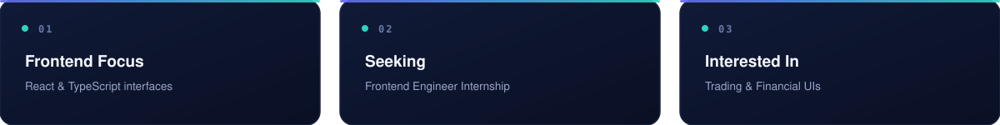

  

  

 

  

  

## 01 About

I am a **Frontend Engineer** passionate about building responsive, high-performance web applications. My development philosophy centers on clean architecture, reusable components, and seamless API integrations.

  

  

## 02 Hackathon Committee

I'm part of the **CodingGita Hackathon Committee**, the student-driven team behind **HackSprint '26** and the upcoming **PixelRush '26** — organizing hackathons end to end, from event design to evaluation.

  

## 03 Focus Areas

  

  

## 04 Skill Proficiency

  

### 04.1 Full Stack

<table width="100%">
<tr>
<td width="25%" align="center" valign="top">

**Core**
  

</td>
<td width="25%" align="center" valign="top">

**Frameworks**
  

</td>
<td width="25%" align="center" valign="top">

**Concepts**
  
`Responsive UI`
`State Management`
`API Integration`
`Auth Flows`
`Performance`

</td>
<td width="25%" align="center" valign="top">

**Tooling**
  

</td>
</tr>
</table>

  <picture>
    <source media="(prefers-color-scheme: light)" srcset="https://www.gitskins.com/api/section/stack?username=paldpathak404&theme=github-dark&mode=light" />
    
  </picture>

  

## 05 GitHub Statistics

  <picture>
    <source media="(prefers-color-scheme: light)" srcset="https://www.gitskins.com/api/section/stats?username=paldpathak404&theme=github-dark&mode=light" />
    
  </picture>

  

## 06 Projects & Work

  <picture>
    <source media="(prefers-color-scheme: light)" srcset="https://www.gitskins.com/api/section/projects?username=paldpathak404&theme=github-dark&mode=light" />
    
  </picture>

  

## 07 Connect

  <picture>
    <source media="(prefers-color-scheme: light)" srcset="https://www.gitskins.com/api/section/social?username=paldpathak404&theme=github-dark&mode=light" />
    
  </picture>

 

